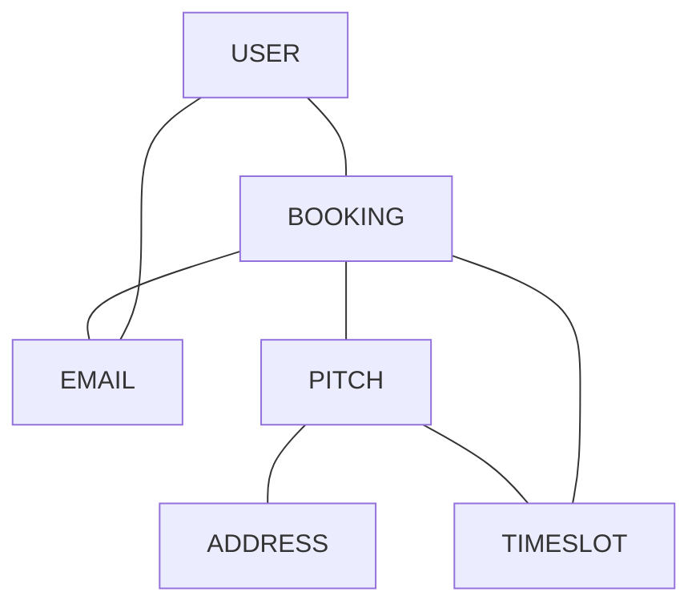
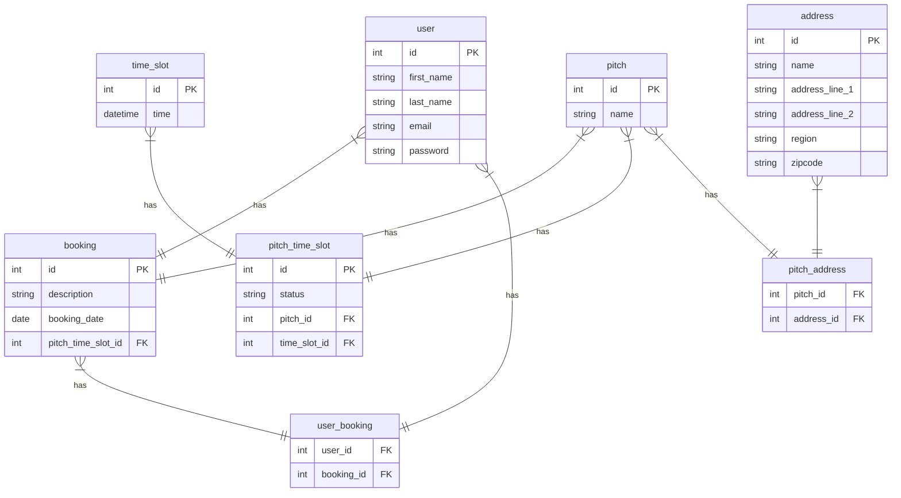

# Book A Pitch
## What is this application?
This is an application that will allow users within a GAA club book a pitch for training / matches on a calendar. There will be indications made on the calendar if a slot is free or booked.
## Why create this application?
The aim is to provide a user with the ability to book a pitch on the date and time that they need it. This application will also allow the user to see when a pitch booking has been cancelled or if a pitch becomes available last minute.
#### MVP:
 - Login
 - Calendar to show pitch bookings
 - Ability for user to create a booking request for an available date.
#### Stretch Goals:
 - Admin can accept a booking request for an available date.
 - A user can complete payment for an accepted booking request.
 - Automatically send email updates to users.
 - Admin / User  Creation
#### Domain Model:

#### ER Diagram:


#### USERS
`GET /users`
Return a list of all users

Response 200
```json
[
  {
     "id": 1,
     "email": "emer@emer.com",
     "first_name": "emer",
     "last_name": "rocks"
  },
  {
     "id": 2,
     "email": "user@user.com",
     "first_name": "user",
     "last_name": "test"
  }
]
```
---

`GET /users/{id}`
Return a user

Response 200
```json
  {
     "id": 2,
     "email": "user@user.com",
     "first_name": "user",
     "last_name": "test"
  }
```
---

`POST /users`
Create a user

Request
```json
{
    "email": "test@test.com",
    "first_name": "Test",
    "last_name": "Tester",
    "password": "password1",
}
```
Response - `201 Created`

---

`PUT /users/{id}`
Update a user by id

Request
```json
{
    "email": "tester@test.com",
    "first_name": "Tester",
    "last_name": "Testing",
   "password": "password2"
}
```
Response - `200 OK`

---

`DELETE /users/{id}`
Delete a user by id

Response - `204 No Content`

---

#### BOOKINGS
`GET /user/{id}/bookings`
Return a list of all user bookings

Response 200
```json
[
 {
     "pitch_time_slot":  {
                           "id": 1,
                           "pitch": {
                                     "id": 1,
                                     "name": "St Pauls"
                                    },
                           "time-slot": {
                                           "id": 1,
                                           "time-slot-start": "2023-01-18 14:30:00.00",
                                           "time-slot-end": "2023-01-18 15:30:00.00"
                                        }
                         },
     "description": "3G pitch",
     "booking_date": "2023-01-18"
 },
 {
     "pitch_time_slot":  {
                           "id": 2,
                           "pitch": {
                                     "id": 2,
                                     "name": "St Galls"
                                    },
                           "time-slot": {
                                           "id": 2,
                                           "time-slot-start": "2023-01-19 14:30:00.00",
                                           "time-slot-end": "2023-01-19 15:30:00.00"
                                        }
                         },
     "description": "Grass pitch",
     "booking_date": "2023-01-19"
 },
]
```
---

`GET /user-bookings/{id}`
Return a user booking by user id

Response 200
```json
 {
     "pitch_time_slot":  {
                           "id": 2,
                           "pitch": {
                                     "id": 2,
                                     "name": "St Galls"
                                    },
                           "time-slot": {
                                           "id": 1,
                                           "time-slot-start": "2023-01-19 14:30:00.00",
                                           "time-slot-end": "2023-01-19 15:30:00.00"
                                        }
                         },
     "user": {
                "name": "Emer Rocks"
             }
     "description": "Grass pitch",
     "booking_date": "2023-01-19"
 }
```
---

`POST /users/{id}/booking`
Create a booking

Request
```json
 {
     "pitch_time_slot_id": 1,
     "user_id": 1,
     "description": "Grass pitch",
},
```
---

`GET /pitches`
Returns all pitches 

Response 200
```json
[
 {
     "id": 1,
     "name": "St.Pauls"
 },
 {
     "id": 2,
     "name": "St.Johns"
 }
]
```
---

`GET /pitches/{id}`
Returns a pitch by id

Response 200
```json
 {
     "id": 1,
     "name": "St.Pauls"
 }
```
---

`GET /pitches/{id}/time-slots`
Returns a pitches time-slots

Response 200
```json
 {
     "id": 1,
     "name": "St.Pauls",
     "pitch-time-slot": [
                           "time-slot": {
                                           "time-slot-start": "2023-01-19 14:30:00.00",
                                           "time-slot-end": "2023-01-19 15:30:00.00"
                                        }
                         ],
 }
```
---

`POST /pitches/{id}/booking`
Create a booking

Request
```json
 {
     "pitch_time_slot_id": 1,
     "user_id": 1,
     "description": "Grass pitch",
},
```
---
