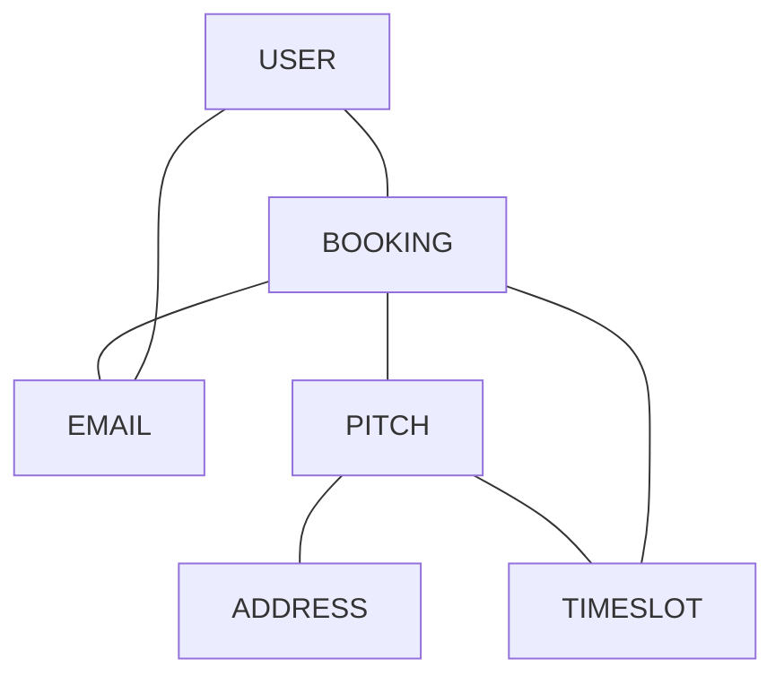
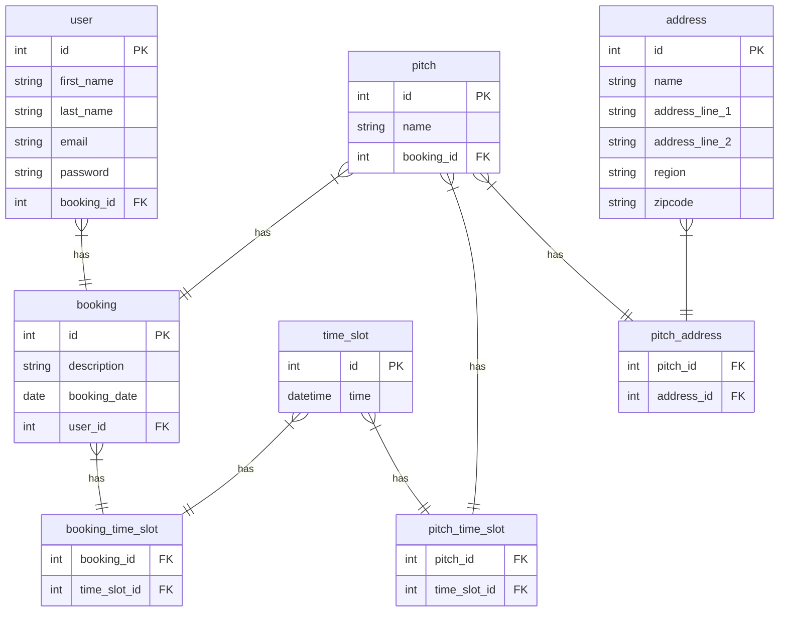

# Book A Pitch
## What is this application?
This is an application that will allow users within a GAA club book a pitch for training / matches on a calendar. There will be indications made on the calendar if a slot is free or booked.
## Why create this application?
The aim is to provide a user with the ability to book a pitch on the date and time that they need it. This application will also allow the user to see when a pitch booking has been cancelled or if a pitch becomes available last minute.
#### MVP:
 - Login
 - Calendar to show pitch bookings
 - Ability for user to create a booking request for an available date.
#### Stretch Goals:
 - Admin can accept a booking request for an available date.
 - A user can complete payment for an accepted booking request.
 - Automatically send email updates to users.
 - Admin / User  Creation
#### Domain Model:

#### ER Diagram:

